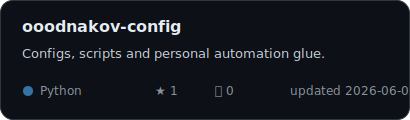
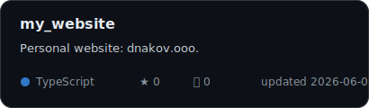
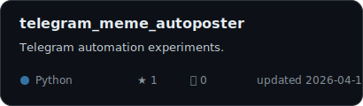
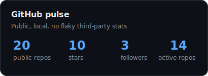
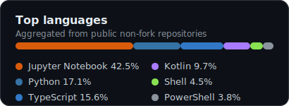

  

<h1 align="center">Hi, I'm Aleksandr</h1>

  <strong>Risk analyst, AI and homelab enjoyer.</strong> 

  
  
  
  <!-- Visitor counter: delete this image if you do not want profile views. -->
  

---

## What I like building

- **Risk & data:** models, dashboards, decision support and clean analytical workflows.
- **AI tooling:** small practical agents, summarizers, automations and local-first AI workflows.
- **Homelab & infrastructure:** self-hosted services, Docker, Linux, monitoring and quiet operations.
- **Telegram/web experiments:** bots, personal tools, small games and useful side projects.

## Stack

  
  
  
  
  
  
  
  
  

## Selected repositories / Избранные репозитории

- [`ooodnakov-config`](https://github.com/ooodnakov/ooodnakov-config) — configs, scripts and personal automation glue.  
- [`my_website`](https://github.com/ooodnakov/my_website) — personal website: [dnakov.ooo](https://dnakov.ooo).
- [`telegram_meme_autoposter`](https://github.com/ooodnakov/telegram_meme_autoposter) — Telegram meme channel automation.
- [`alioss`](https://github.com/ooodnakov/alioss) / [`alioss-site`](https://github.com/ooodnakov/alioss-site) — Android game + website.

<!-- Project cards: static local SVGs; regenerate with `python3 scripts/generate-widgets.py`. -->

  
  
  

## GitHub pulse

<!-- Widgets: static local SVGs; regenerate with `python3 scripts/generate-widgets.py`. -->
<!-- widgets:start -->

  
  

<!-- widgets:end -->
