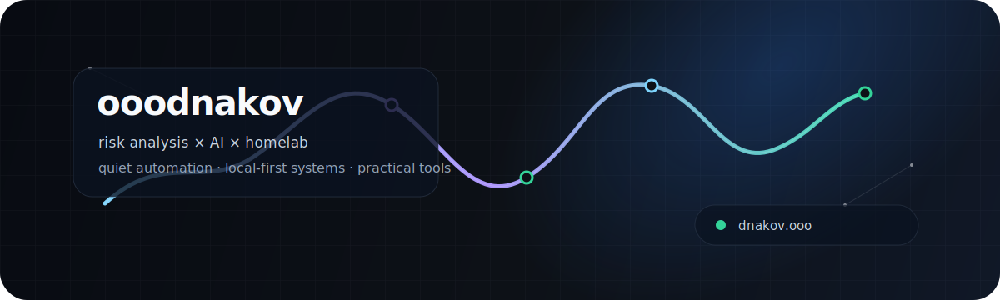
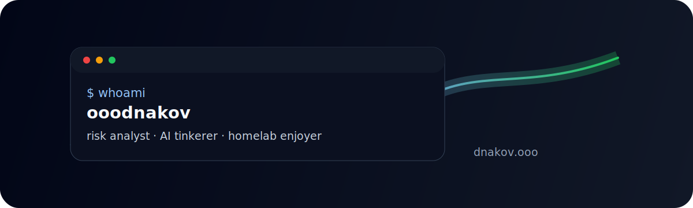

<p align="center">
  
</p>

<h1 align="center">Hi, I'm Aleksandr / Привет, я Александр</h1>

<p align="center">
  <strong>Risk analyst, AI and homelab enjoyer.</strong><br />
  Анализ рисков, практичные AI-инструменты, локальная инфраструктура и автоматизация без лишнего шума.
</p>

<p align="center">
  <a href="https://dnakov.ooo"></a>
  
  
  <!-- Visitor counter: delete this image if you do not want profile views. -->
  
</p>

---

## What I like building / Что мне интересно

- **Risk & data:** models, dashboards, decision support and clean analytical workflows.  
  **Риски и данные:** модели, дашборды, поддержка решений и аккуратные аналитические процессы.
- **AI tooling:** small practical agents, summarizers, automations and local-first AI workflows.  
  **AI-инструменты:** небольшие полезные агенты, суммаризация, автоматизация и local-first подход.
- **Homelab & infrastructure:** self-hosted services, Docker, Linux, monitoring and quiet operations.  
  **Homelab и инфраструктура:** self-hosted сервисы, Docker, Linux, мониторинг и меньше ручной рутины.
- **Telegram/web experiments:** bots, personal tools, small games and useful side projects.  
  **Telegram/web эксперименты:** боты, личные инструменты, небольшие игры и сайд-проекты.

## Stack / Инструменты

<p>
  
  
  
  
  
  
  
  
  
</p>

## Selected repositories / Избранные репозитории

- [`ooodnakov-config`](https://github.com/ooodnakov/ooodnakov-config) — configs, scripts and personal automation glue.  
  Конфиги, скрипты и связка для личной автоматизации.
- [`my_website`](https://github.com/ooodnakov/my_website) — personal website: [dnakov.ooo](https://dnakov.ooo).  
  Личный сайт: [dnakov.ooo](https://dnakov.ooo).
- [`telegram_meme_autoposter`](https://github.com/ooodnakov/telegram_meme_autoposter) — Telegram automation experiments.  
  Эксперименты с автоматизацией Telegram.
- [`GMP_TTA`](https://github.com/ooodnakov/GMP_TTA) — LiDAR semantic segmentation research code.  
  Код исследовательского проекта по semantic segmentation для LiDAR.
- [`alioss`](https://github.com/ooodnakov/alioss) / [`alioss-site`](https://github.com/ooodnakov/alioss-site) — Android game + website.  
  Android-игра и сайт к ней.
- [`quantum_2048`](https://github.com/ooodnakov/quantum_2048) — small JavaScript game experiment.  
  Небольшой игровой эксперимент на JavaScript.

<!-- Project cards: delete this block if you want a lighter profile. -->
<p align="center">
  <a href="https://github.com/ooodnakov/ooodnakov-config"></a>
  <a href="https://github.com/ooodnakov/my_website"></a>
  <a href="https://github.com/ooodnakov/telegram_meme_autoposter"></a>
  <a href="https://github.com/ooodnakov/GMP_TTA"></a>
</p>

## GitHub pulse / Стата

<!-- Widgets: delete everything between widgets:start and widgets:end to remove all dynamic widgets. -->
<!-- widgets:start -->
<p align="center">
  
  
</p>

<p align="center">
  
</p>

<p align="center">
  
</p>

<p align="center">
  
</p>
<!-- widgets:end -->

---

<details>
  <summary><strong>Banner and cleanup notes / Как менять и убирать</strong></summary>

### Banner options / Варианты баннера

Current banner: `assets/banner.svg` — minimal signal line.  
Сейчас стоит: `assets/banner.svg` — минималистичная линия сигнала.

Other included options:

- `assets/banner-terminal.svg` — terminal-style card.
- `assets/banner-network.svg` — clean network/map style.

To switch, change the first image in `README.md`:

```html

```

### Remove widgets / Убрать виджеты

- All dynamic stats: delete the block between `<!-- widgets:start -->` and `<!-- widgets:end -->`.
- Project cards: delete the block after `<!-- Project cards: ... -->`.
- Visitor counter: delete the `komarev.com/ghpvc` image near the top.
- Banner: delete the first `<p align="center"> ... </p>` block or replace `assets/banner.svg` with another file.

</details>
